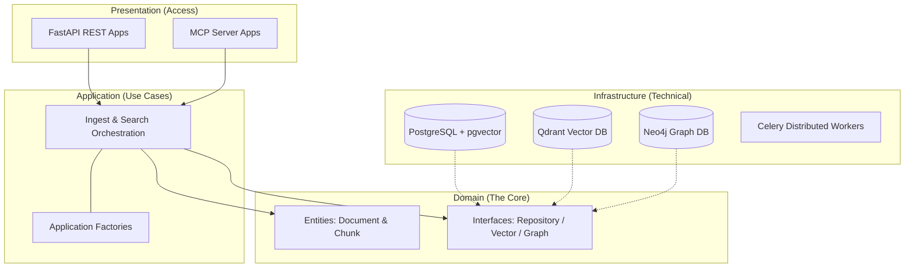

# Data Layer Manager Technical Documentation

**Library-first, Modular Monolith backend for modern AI Knowledge Systems.**

---

## 1. Introduction

`data-layer-manager` is a high-performance, reusable data layer designed for enterprise-grade Retrieval-Augmented Generation (RAG). It serves as the bridge between raw data sources and AI agents, providing a unified interface for ingestion, storage, and context retrieval.

### Core Objectives
- **Single Source of Knowledge**: Centralized management of documents and chunks across multiple vector and graph backends.
- **AI-Ready Interfaces**: Native support for **Model Context Protocol (MCP)** and **FastAPI** REST abstractions.
- **Traceability**: End-to-end metadata tracking from raw file origin to final retrieval candidate.

---

## 2. System Architecture

The project adheres to **Clean Architecture** principles combined with a **Modular Monolith** strategy. This ensures that the core logic is decoupled from external delivery mechanisms (API/MCP) and infrastructure tools (Postgres/Qdrant).

### 2.1 layer Architecture
Dependencies strictly point inward:



### 2.2 Modular Monolith Strategy
The system is organized into a core library (`data_layer_manager/`) and independent entry-point applications (`apps/`):
- **Core Library**: Contains all business rules, persistence logic, and interface definitions. It is agnostic of its caller.
- **Application Apps**: Each app (REST API, MCP, Celery Worker) is a thin wrapper that initializes the core library via a shared factory pattern.

- [x] Document **Unified Application Factory** (`factories.py` pattern).
- [x] Document **Retrieval Engine Deep Dive** (Vector, Graph, RRF Fusion).
- [/] Document **Ingestion Pipeline** (Parser Registry, Async Workers).
- [/] Document **AI Connectivity (MCP)** (Tools, SSE, Protocol).

---

## 3. Unified Application Factories

To ensure consistency and driver parity across different access methods, the system implements a **Singleton Factory Pattern** in `data_layer_manager/application/factories.py`.

### 3.1 Purpose
The factory serves as the dependency injection hub for the entire system:
- **Consistency**: The same embedding logic used in the background word ingestion is identically mirrored in the real-time MCP search tools.
- **Resource Management**: It ensures that database connection pools (Postgres/Neo4j/Qdrant) are reused efficiently.

### 3.2 Usage
Apps initialize the factory once and access the necessary orchestrators:
```python
from data_layer_manager.application.factories import AppFactory

# Get the thread-safe singleton
factory = AppFactory()

# Access high-level services
search_service = factory.get_retrieval_service()
ingestion_service = factory.get_ingestion_service()
```

---

## 4. Retrieval Engine Deep Dive

The retrieval engine implements a sophisticated **Strategy Pattern** to merge multiple disparate data sources into a unified context response.

### 4.1 Hybrid Retrieval Logic
The system supports multiple query paths simultaneously:
- **Semantic Path**: Uses embedding similarity (vector search) for natural language matching.
- **Lexical Path**: Uses Full-Text Search (FTS) for precise keyword matching.
- **Graph Path**: Uses graph traversal (Neo4j) to find related contextual data points.

### 4.2 Reciprocal Rank Fusion (RRF)
To combine results from different stores (e.g., Qdrant scores vs. BM25 scores), the system uses the **RRF Algorithm**:
1.  **Normalization**: Each result set is ranked independently.
2.  **Weighted Scoring**: A unified score is calculated based on its rank in each sub-set.
3.  **Result Aggregation**: The highest-ranked items across all paths are returned as the final context.

### 4.3 Supported Endpoints
- **Vector Search**: PGVector (local), Qdrant (high-scale).
- **Relational Metadata**: Neo4j (relationship Graph-RAG).
- **Re-ranking**: Second-stage cross-encoder refinement for maximum relevance.

---

## 5. Ingestion Pipeline

The ingestion pipeline transforms raw unstructured data into structured, searchable knowledge units.

### 5.1 Pluggable Parser Registry
In `infrastructure/parsers/factory.py`, the system maintains a registry of format-specific handlers:
- **`TrafilaturaParser`**: Extracting clean text from HTML/Web sources.
- **`PyMuPDFParser`**: High-fidelity PDF extraction.
- **`DocxParser`**: Microsoft Word formatting preservation.

### 5.2 The Enrichment Workflow
1.  **Normalization**: Text is stripped of boilerplate and normalized to UTF-8.
2.  **Semantic Chunking**: Documents are split into overlapping blocks to ensure context is preserved across boundaries.
3.  **Graph Linkage**: Chunks are linked to their parent `Document` nodes in Neo4j with `HAS_CHUNK` relationships.
4.  **Vectorization**: Batched embedding occurs using specified drivers (OpenAI/HuggingFace).

---

## 6. AI Connectivity (MCP)

`data-layer-manager` natively implements the **Model Context Protocol (MCP)** via the `apps/mcp/` application.

### 6.1 Server Architecture
The server uses **SSE (Server-Sent Events)** for client-server communication, allowing for stateful tool discovery.

### 6.2 Exposed Tools
- **`ingest_text`**: Allows agents to save new knowledge to the layer in real-time.
- **`search_knowledge`**: Enables agents to query the hybrid retrieval engine directly.
- **`verify_health`**: Diagnostics for backend store availability.

### 6.3 LLM Interaction Flow
AI tools (like Claude Code) connect to the MCP server to retrieve relevant snippets. The server initializes the `AppFactory` to ensure it uses the exact same retrieval logic as the primary REST API, maintaining knowledge parity.

---

## 7. Operational Infrastructure

### 7.1 Docker Orchestration
The project uses `docker-compose.yml` to orchestrate a production-ready stack:
- **`app/worker`**: The FastAPI and Celery worker instances.
- **`db`**: PostgreSQL with `pgvector` for relational and vector metadata.
- **`vectorstore`**: Qdrant for dedicated high-scale vector indexing.
- **`graphstore`**: Neo4j for semantic relationship mapping.
- **`cache`**: Redis for Celery task brokering and metadata caching.

### 7.2 Configuration Management
Settings are managed in `data_layer_manager/config/settings.py` using **Pydantic Settings**:
- **Environment Parity**: `.env` files and system variables are automatically validated.
- **Secret Management**: Sensitive keys (API keys, DB credentials) are kept out of the codebase.

### 7.3 Performance Scaling
- **Async Workers**: The Celery implementation ensures that long-running ingestion (parsers/embeddings) does not block the real-time API.
- **Batch Embedding**: Vector stores are populated using batched Upsert calls to minimize overhead.
- **Index Tuning**: HNSW indices are automatically configured for production performance in Qdrant and pgvector.
