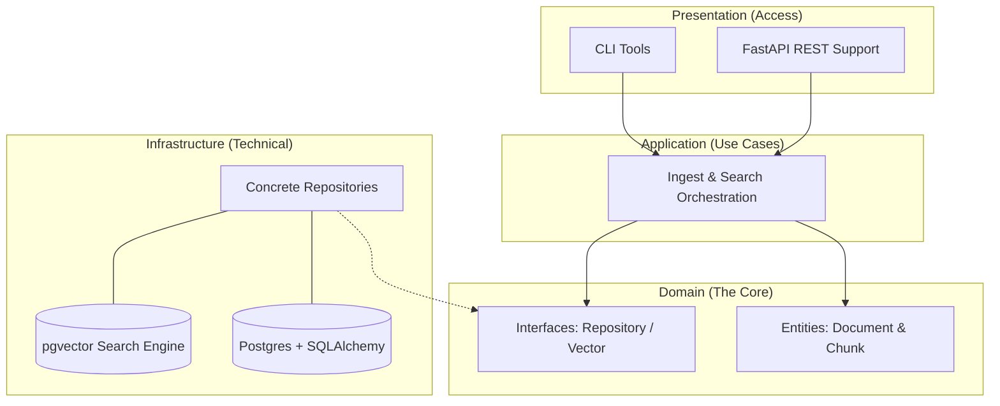

# Project Architecture Guide

This project follows **Clean Architecture** principles, ensuring a clear separation between business logic and infrastructure.

## 🏗️ Layer Dependency Diagram
The most critical rule is that **dependencies always point inward**. The Domain layer never knows about the database or external APIs.

## 📂 Directory to Layer Mapping

| Directory | Layer | Purpose |
| :--- | :--- | :--- |
| `data_layer_manager/domain/` | **Core** | Pure logic, entities, and repository interfaces. |
| `data_layer_manager/application/` | **Use Case** | Coordinates the workflow between domain and infra. |
| `data_layer_manager/infrastructure/` | **Adapter** | Concrete database models and repository implementations. |
| `data_layer_manager/presentation/` | **Gateway** | How the user (human or machine) triggers the app. |
